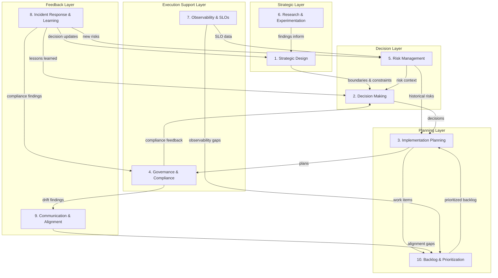
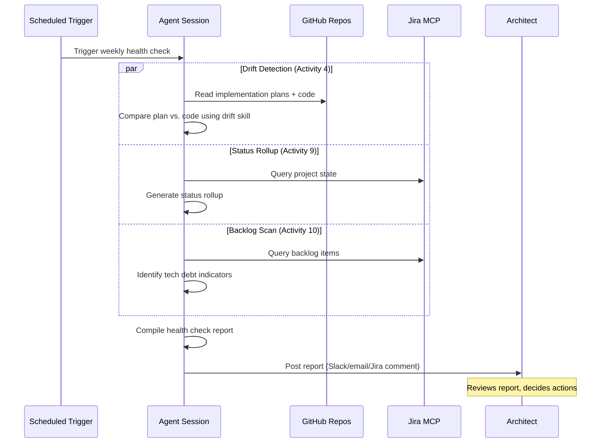
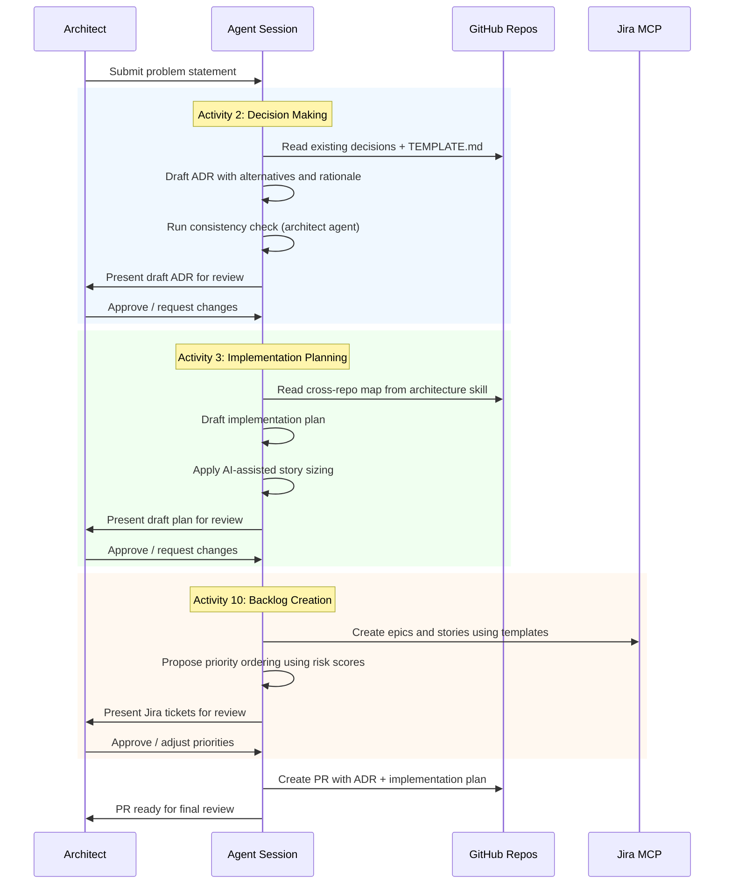
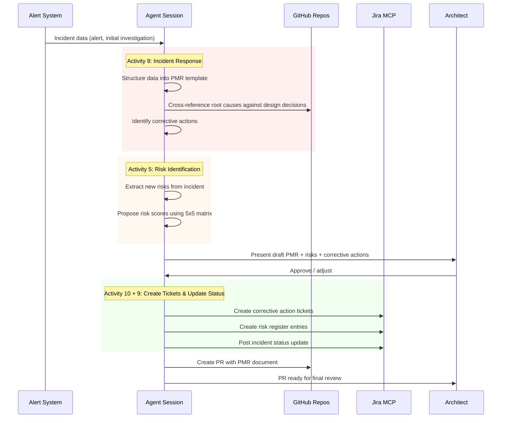

# Architecture Workflow: AI-Assisted Architecture Activities

This document defines the end-to-end workflow for architecture activities in GCP HCP. Each activity specifies its inputs, outputs, process steps, LLM hooks, and human-in-the-loop gates. It also assesses which steps can run on an agentic orchestration platform.

**Audience**: Architects, tech leads, and AI agents working on GCP HCP architecture.

**Document status**: Living document. Last reviewed: 2026-04-09.

**Tool maturity legend**: References to tools and skills use these status markers:
- **(exists)** — implemented and usable today via manual invocation
- **(planned)** — designed but not yet implemented or integrated
- **(manual)** — process exists as documentation/checklist, not tool-automated
- **(draft)** — document exists but is not yet adopted by the team

**Foundational decisions**:
- [AI-Centric SDLC](../design-decisions/ai-centric-sdlc.md) — human review for all AI-generated content before merging
- [Agent Autonomy Levels](../design-decisions/agent-autonomy-levels.md) — 3-stage model: read-only, interactive, automated
- [Automation-First Philosophy](../design-decisions/automation-first-philosophy.md) — "allergic to toil"

---

## Activity Relationship Map

The 10 architecture activities form a lifecycle across five layers. Activities are not sequential — multiple run in parallel and continuously, with feedback loops between layers.

**Primary pipeline**: Activities 1 → 2 → 3 form the "design-to-build" path. Activities 4-10 are supporting cycles that feed back into it.

---

## HITL Gate Protocol

All HITL gates in this document follow this protocol unless the gate's row specifies an override.

| Aspect | Default |
|--------|---------|
| **Approver** | The architect assigned to the capability area. For security-critical gates, the SRE team lead co-approves. |
| **SLA** | 2 business days. If unresolved, the gate auto-escalates to the engineering manager. |
| **Acceptance criteria** | The gate's row in the Process Steps table specifies what is being reviewed. The reviewer must confirm: (1) technical correctness, (2) consistency with architectural invariants, (3) completeness per the output format. |
| **Conflict resolution** | If architect and reviewer disagree: (1) document both positions in the PR/ticket, (2) escalate to engineering manager within 1 business day, (3) manager decides or calls a synchronous meeting within 2 business days. |
| **Mechanism** | PR review comment (for code/doc artifacts) or Jira ticket comment (for Jira-only artifacts). |

---

## Definition of Done for Architecture Artifacts

| Artifact | Done When |
|----------|-----------|
| Design Decision (ADR) | All `TEMPLATE.md` sections complete, consistency check passed, team review approved, architecture skill topic index updated |
| Implementation Plan | All sections complete, Jira epics/stories created with links, risk items handed off, PR merged |
| Study Document | Research question answered, options with trade-offs documented, go/no-go decision recorded |
| Risk Register Entry | Scored using 5x5 matrix from `docs/risk-scoring.md`, Jira ticket created, mitigation owner assigned |
| SLO Document | Targets set, PromQL queries included, alert policies defined, PR merged |
| Post-Mortem Report (PMR) | Timeline complete, root causes validated, corrective action tickets created, design decision cross-reference completed |

---

## Activities

### 1. Strategic Design

**Description**: Define system boundaries, C4 models, architectural invariants, non-functional requirements (NFRs), and technology selections.

**Trigger**: Any of:
- New Jira feature (type=Feature) approved for the GCP project
- Quarterly architecture review (first Monday of each quarter)
- Post-mortem action item tagged `arch-review-needed` (from Activity 8)
- Design decision with status "Proposed" that touches 3+ repositories (per cross-repo map)

#### Inputs

| Input | Source | Required |
|-------|--------|----------|
| Business requirements | Jira features via `jira:get_issue` **(exists)** | Yes |
| Existing C4 models | `experiments/arch/L1 Context/`, `L2 Container/`, `L3 Component/` | Yes |
| Current design decisions | `design-decisions/*.md` | Yes |
| Architectural invariants | `gcp-hcp-architecture` skill **(exists)** | Yes |
| Technology landscape | Web research, vendor docs | No |
| Research findings | `studies/*.md` (from Activity 6) | No |
| Incident lessons learned | `incidents/*.md` (from Activity 8) | No |

#### Process Steps

| Step | Action | Actor | LLM Hook | HITL Gate |
|------|--------|-------|----------|-----------|
| 1 | Gather requirements from Jira features and stakeholder input | Architect + LLM | `jira:get_issue` to summarize epics | Confirm scope: requirements match the capability area, no out-of-scope items included |
| 2 | Review existing architecture models and identify gaps | LLM | `gcp-hcp-architecture` skill loads current constraints | — |
| 3 | Draft or update C4 model at appropriate level | LLM + Architect | Generate Mermaid diagrams from textual descriptions | Review boundary accuracy: system boundaries match organizational and deployment boundaries, no orphaned components |
| 4 | Identify architectural invariants | LLM + Architect | Cross-reference existing invariants from architecture skill | Approve new invariants: document in a design decision, then update the architecture skill's topic index to reference it |
| 5 | Define NFRs for the new capability | LLM + Architect | Suggest targets based on similar systems | Set actual targets: each NFR has a measurable threshold and measurement method |
| 6 | Document technology selections requiring a formal decision | LLM | Draft initial context section for ADR | Create Jira task (type=Task, label=`adr-needed`) linking to the capability area. Feeds Activity 2. |

#### Outputs

| Output | Location | Format |
|--------|----------|--------|
| Updated C4 models | `experiments/arch/` | Markdown + Mermaid |
| New invariants | `claude-plugin/gcp-hcp/skills/gcp-hcp-architecture/SKILL.md` (invariants section) | Markdown |
| NFR targets | Design decision or implementation plan | Markdown table |
| Design decisions needed | Jira task (type=Task, label=`adr-needed`) linking to capability area | Problem statement following `TEMPLATE.md` Context section format |

#### Context/Data Required

- All files in `experiments/arch/`
- All files in `design-decisions/`
- Cross-repo map from architecture skill **(exists)** (hypershift, gcp-hcp-infra, cls-backend, cls-controller, gcp-hcp-cli)
- Jira features via MCP **(exists)**

#### Agentic Platform Potential

| Aspect | Assessment |
|--------|------------|
| Maturity | **Near-Term** |
| Rationale | C4 model updates and invariant cross-checking can be automated. Boundary decisions and NFR targets require human judgment. |
| Agentic Workflow | Draft C4 update from requirements → present for review |
| Blockers | System boundary decisions are fundamentally architectural judgment calls |

#### Success Metrics

| Metric | Target | Measurement |
|--------|--------|-------------|
| C4 model currency | All L1/L2 models updated within 30 days of a new capability | Manual audit at quarterly review |
| Invariant coverage | All invariants have at least 1 governance check (Activity 4) | Count of invariants with corresponding checks |

---

### 2. Decision Making

**Description**: Author Architecture Decision Records (ADRs), evaluate trade-offs, and check consistency with existing decisions.

**Trigger**: Any of:
- Jira task with label `adr-needed` created (from Activity 1 or Activity 8)
- Architect identifies a new architectural question during implementation review
- Study document (Activity 6) concludes with a recommendation requiring formal decision

#### Inputs

| Input | Source | Required |
|-------|--------|----------|
| Problem statement | Architect, Jira ticket, or incident | Yes |
| ADR template | `design-decisions/TEMPLATE.md` | Yes |
| Existing decisions | `design-decisions/*.md` | Yes |
| Research findings | `studies/*.md` | No |
| Architectural invariants | `gcp-hcp-architecture` skill **(exists)** | Yes |

#### Process Steps

| Step | Action | Actor | LLM Hook | HITL Gate |
|------|--------|-------|----------|-----------|
| 1 | Check if a relevant decision already exists | LLM | Grep existing decisions for overlapping scope | — |
| 2 | If novel, create study document | LLM + Architect | Draft study with options from research | Validate options are complete: at least 2 viable alternatives articulated with trade-offs |
| 3 | Draft ADR from template | LLM | Fill `TEMPLATE.md` sections: context, alternatives, rationale | Review content quality: all `TEMPLATE.md` required sections populated, alternatives include at least 2 options, rationale addresses each alternative, no conflicts flagged by consistency check (step 4) |
| 4 | Run consistency check against existing decisions | LLM | Architect agent **(exists, manual invocation)** validates no conflicts | Resolve conflicts: each conflict documented with resolution rationale |
| 5 | Run template validation checklist | LLM | Automated checklist verification from `TEMPLATE.md` | — |
| 6 | Team review and approval | Team | — | **Mandatory**: at least 2 team members approve via PR review |
| 7 | Update architecture skill topic index | LLM | Add entry to `gcp-hcp-architecture` skill | — |

#### Outputs

| Output | Location | Format |
|--------|----------|--------|
| Architecture Decision Record | `design-decisions/<name>.md` | ADR template format |
| Study document (if needed) | `studies/<name>.md` | Study format |
| Updated architecture skill | `claude-plugin/gcp-hcp/skills/gcp-hcp-architecture/SKILL.md` | Topic index entry |

#### Context/Data Required

- `design-decisions/TEMPLATE.md` for structure
- All existing `design-decisions/*.md` for consistency checking
- `studies/` for prior research
- Architect agent (`.claude/agents/architect.md`) **(exists, manual invocation)** for compliance validation

#### Agentic Platform Potential

| Aspect | Assessment |
|--------|------------|
| Maturity | **Ready Now (partial)** |
| Rationale | Architect agent already does consistency checking when manually invoked. ADR drafting from a clear problem statement is within current LLM capability. The decision itself requires human judgment. |
| Agentic Workflow | Receive problem statement → draft study + ADR → run consistency check → create PR for review |
| Blockers | The actual decision choice (which alternative to pick) is always human |

#### Success Metrics

| Metric | Target | Measurement |
|--------|--------|-------------|
| Decision cycle time | Problem statement to approved ADR <= 10 business days | Jira ticket created-to-resolved time |
| Consistency check pass rate | >= 90% of ADRs pass consistency check on first attempt | Architect agent output logs |
| Decision coverage | 0 architectural questions resolved informally (without an ADR) per quarter | Quarterly audit |

---

### 3. Implementation Planning

**Description**: Translate approved design decisions into implementation plans with work decomposition and sequencing.

**Trigger**: Design decision approved and implementation scheduled (ADR merged to `main`).

#### Inputs

| Input | Source | Required |
|-------|--------|----------|
| Approved design decision | `design-decisions/<name>.md` | Yes |
| Jira templates | `docs/jira-epic-template.md`, `docs/jira-story-template.md` | Yes |
| Story sizing guide | `docs/story-sizing-ai-assisted.md` **(draft)** — fall back to `docs/jira-story-template.md` pointing criteria until adopted | Yes (one of the two) |
| Cross-repo map | Architecture skill **(exists)** | Yes |
| Existing plans | `implementation-plans/*.md` | Yes |
| Historical risks | Risk register in Jira (from Activity 5) | No |

#### Process Steps

| Step | Action | Actor | LLM Hook | HITL Gate |
|------|--------|-------|----------|-----------|
| 1 | Extract implementation scope from decision | LLM | Parse components affected, constraints, consequences | — |
| 2 | Identify affected repositories | LLM | Architecture skill maps components to repos | — |
| 3 | Draft implementation plan | LLM + Architect | Generate plan following `implementation-plans/` format | Review scope and approach: all affected repos identified, no missing components, approach is consistent with the ADR |
| 4 | Decompose into Jira epics and stories | LLM | `jira:create` skill **(exists)** with templates from `docs/` | Review sizing and sequencing: stories are independently deliverable, sequencing respects dependencies |
| 5 | Apply AI-assisted story sizing | LLM | 3-dimension framework from `docs/story-sizing-ai-assisted.md` **(draft — not yet adopted; use existing pointing criteria from `docs/jira-story-template.md` until finalized)** | Validate scores |
| 6 | Identify dependencies and sequencing | LLM + Architect | Cross-reference with existing plans for conflicts | Approve sequencing: no circular dependencies, critical path identified |
| 7 | Initial risk identification | LLM | Extract from decision's "Negative Consequences" section | Create Jira task (type=Task, label=`risk-review`) with link to implementation plan. Feeds Activity 5. |

#### Outputs

| Output | Location | Format |
|--------|----------|--------|
| Implementation plan | `implementation-plans/<name>.md` | Markdown |
| Jira epics | Jira GCP project | Epic template format |
| Jira stories | Jira GCP project | Story template format |
| Risk items | Jira task (type=Task, label=`risk-review`) linking to implementation plan | Risk description following `docs/risk-scoring.md` format |

#### Context/Data Required

- Relevant design decision document
- `implementation-plans/` for format reference
- `docs/` templates for Jira ticket creation
- Jira MCP **(exists)** for ticket creation
- Architecture skill **(exists)** for repo mapping

#### Agentic Platform Potential

| Aspect | Assessment |
|--------|------------|
| Maturity | **Ready Now (partial)** |
| Rationale | Plan drafting and Jira ticket creation are already supported by existing skills. |
| Agentic Workflow | Read decision → draft plan → create Jira tickets → open PR for plan review |
| Blockers | Scope validation and dependency analysis require human review |

#### Success Metrics

| Metric | Target | Measurement |
|--------|--------|-------------|
| Plan-to-code drift rate | <= 20% of plan items flagged as "needs review" at first drift check | Drift report output from Activity 4 |
| Story sizing accuracy | Actual effort within 1 Fibonacci step of estimate for >= 70% of stories | Sprint retrospective data |
| Plan completeness | 0 implementation plans missing Jira ticket links at PR merge | PR review checklist |

---

### 4. Governance & Compliance

**Description**: Enforce architectural invariants, review PRs for compliance, detect drift between plans and code, validate security controls.

**Trigger**: Any of:
- PR opened or updated in a GCP HCP repository (per-PR, on-demand)
- Weekly post-merge drift scan (Monday 08:00 UTC — **(planned)**, not yet implemented as CronJob)
- On-demand via `fix-implementation-plan-drifts` skill invocation
- Incident compliance findings received (from Activity 8, label=`compliance-review`)

#### Inputs

| Input | Source | Required |
|-------|--------|----------|
| PR diffs | GitHub | Yes |
| Architectural invariants | `gcp-hcp-architecture` skill **(exists)** (6 invariants) | Yes |
| Design decisions | `design-decisions/*.md` | Yes |
| Implementation plans | `implementation-plans/*.md` | Yes |
| Security rules | `AGENTS.md` (Security Rules section) | Yes |
| Incident compliance findings | Post-mortem corrective actions tagged `compliance-review` (from Activity 8) | No |

#### Process Steps

| Step | Action | Actor | LLM Hook | HITL Gate |
|------|--------|-------|----------|-----------|
| 1 | PR opens — compliance review | LLM | Architect agent **(exists, manual invocation)** validates against invariants and decisions | — |
| 2 | Security compliance check (language-aware) | LLM + Architect | Architect agent validates against `AGENTS.md` security rules: Go code → Go secure coding rules, Python code → Python rules, Container defs → Container rules, all code → Security Principles and Controls | Security-critical items flagged: any finding in Authentication, Authorization, Encryption, or Cross-Tenant Isolation requires SRE team lead co-approval. SLA: 1 business day for security items. |
| 3 | Post-merge drift detection | LLM | `fix-implementation-plan-drifts` skill **(exists, manual invocation)** compares plan vs. code | Review "needs review" items: reviewer determines whether the plan or the code is correct. Each item marked as "update plan" or "flag for team discussion." |
| 4 | Periodic invariant audit | LLM + Architect | Scan codebase for invariant violations | Approve remediation: each violation has a fix or a documented exception |

#### Outputs

| Output | Location | Format |
|--------|----------|--------|
| PR review comments | GitHub PR | Inline comments |
| Drift report | PR comment or Jira | Drift report table (columns: Plan Says, Code Does, Fix) |
| Compliance findings | PR comment | Categorized findings |
| Updated implementation plans | `implementation-plans/` | Markdown |

#### Context/Data Required

- Architect agent (`.claude/agents/architect.md`) **(exists, manual invocation)** — review checklist and personality template; does not perform automated CI checks
- Drift detection skill (`claude-plugin/gcp-hcp/skills/fix-implementation-plan-drifts/SKILL.md`) **(exists, manual invocation)** — code review process guide, not automated post-merge tool
- `AGENTS.md` security rules
- All `design-decisions/` and `implementation-plans/`
- Cross-repo code access (hypershift, gcp-hcp-infra, cls-backend, cls-controller, gcp-hcp-cli)

#### Agentic Platform Potential

| Aspect | Assessment |
|--------|------------|
| Maturity | **Ready Now (LLM-assisted)** |
| What works today | Architect agent (`.claude/agents/architect.md`) performs on-demand compliance review when invoked by a human during PR review. Drift detection skill (`fix-implementation-plan-drifts`) performs on-demand plan-vs-code comparison when invoked by a human. Both require human invocation and human judgment for results. |
| What does NOT exist yet | Automated per-PR compliance checking (no CI integration). Scheduled post-merge drift detection (no CronJob). Automated invariant auditing. |
| Agentic Workflow | (Planned) Run drift detection on schedule, post results to Jira or PR comment |
| Blockers | Security-critical items and ambiguous drift ("needs review") require human judgment. CI integration for automated per-PR checking is not yet built. |

#### Success Metrics

| Metric | Target | Measurement |
|--------|--------|-------------|
| Drift detection coverage | 100% of implementation plans scanned at least monthly | Drift report frequency log |
| Compliance finding resolution time | Security-critical: <= 2 business days. Other: <= 1 sprint | Jira ticket age |
| Invariant violation rate | 0 undetected invariant violations reaching production per quarter | Post-mortem cross-reference |

---

### 5. Risk Management

**Description**: Identify and score risks, conduct threat modeling, track mitigations.

**Trigger**: Any of:
- Implementation plan created or updated (Activity 3 output, Jira task label=`risk-review`)
- Post-mortem corrective action tagged `new-risk` (Activity 8 step 7)
- Design decision with "Negative Consequences" section added or modified
- Quarterly risk register review (aligned with Activity 1 quarterly cadence)

#### Inputs

| Input | Source | Required |
|-------|--------|----------|
| Risk scoring guide | `docs/risk-scoring.md` | Yes |
| Design decision consequences | `design-decisions/*.md` (Negative Consequences) | Yes |
| Incident post-mortems | `incidents/*.md` | No |
| Implementation plans | `implementation-plans/*.md` | No |

#### Process Steps

| Step | Action | Actor | LLM Hook | HITL Gate |
|------|--------|-------|----------|-----------|
| 1 | Identify risks from design decisions | LLM | Extract from "Negative Consequences" and "Cross-Cutting Concerns" | — |
| 2 | Score risks using 5x5 matrix | LLM + Architect | Propose impact/probability scores with rationale | Validate scores: confirm ratings are consistent with existing risk register entries of similar severity. Scores of Critical (impact >= 4 AND probability >= 4) require SRE team lead co-approval. |
| 3 | Create risk register entries in Jira | LLM | `jira:create` skill **(exists)** | Approve risk classification |
| 4 | Threat modeling for security-sensitive features | LLM + Architect | Identify attack surfaces from architecture | Validate threat model: all external-facing interfaces covered, authentication/authorization boundaries identified |
| 5 | Track mitigation progress | LLM | `jira:status-rollup` skill **(exists)** for risk ticket status | — |
| 6 | Update risk scores when context changes | LLM + Architect | Re-evaluate based on new data | Approve changes: document what changed and why the score shifted |

#### Outputs

| Output | Location | Format |
|--------|----------|--------|
| Risk register entries | Jira GCP project | Jira tickets (type=Task, label=`risk-register`) |
| Threat models | `studies/` or design decision | Markdown |
| Mitigation tracking | Jira status rollup | Report |

#### Context/Data Required

- `docs/risk-scoring.md` (5x5 matrix, severity bands, risk categories)
- Consequences sections from `design-decisions/`
- `incidents/` for historical risks
- Jira MCP **(exists)** for ticket creation and status queries

#### Agentic Platform Potential

| Aspect | Assessment |
|--------|------------|
| Maturity | **Near-Term** |
| Rationale | Risk identification and scoring proposals can be automated. Threat modeling requires human security expertise. |
| Agentic Workflow | Scan new decisions for risks → propose scores → create Jira tickets → track mitigations |
| Blockers | Probability and impact scoring are judgment calls; threat modeling needs security domain expertise |

#### Success Metrics

| Metric | Target | Measurement |
|--------|--------|-------------|
| Risk register completeness | All Critical/High risks have assigned mitigations within 1 sprint | Jira query on risk tickets |
| Risk prediction accuracy | <= 30% of incidents trace to risks NOT in the register | Post-mortem cross-reference |
| Mitigation closure rate | >= 80% of mitigations completed within their target sprint | Jira ticket status |

---

### 6. Research & Experimentation

**Description**: Conduct studies, build PoCs, evaluate technologies, document findings.

**Trigger**: Architect or tech lead determines that a design decision cannot proceed because:
- Fewer than 2 viable alternatives can be articulated, OR
- No team member has operational experience with the proposed technology, OR
- A spike is requested during grooming (Activity 10 step 3)

The triggering architect creates a Jira task (type=Task, label=`research-spike`) linking to the blocked decision.

#### Inputs

| Input | Source | Required |
|-------|--------|----------|
| Problem statement | Architect | Yes |
| Existing studies | `studies/` | No |
| Technology landscape | Web research, vendor docs | Yes |
| Existing experiments | `experiments/` | No |

#### Process Steps

| Step | Action | Actor | LLM Hook | HITL Gate |
|------|--------|-------|----------|-----------|
| 1 | Define research question and scope | Architect | — | **Define what we need to learn**: research question documented, success criteria for the study defined |
| 2 | Survey existing solutions and prior art | LLM | Web search, vendor doc analysis | — |
| 3 | Design PoC | LLM + Architect | Scaffold experiment structure | Approve approach: PoC scope is minimal and focused on answering the research question |
| 4 | Execute PoC and document findings | Architect + LLM | Assist with code generation | Interpret results: findings are documented with data, not just opinions |
| 5 | Write study document | LLM | Draft study with options and trade-offs | Review accuracy: trade-offs are balanced, no missing options |
| 6 | Present findings to team | Architect | — | **Go/no-go decision**: team votes to proceed to ADR, pivot research, or abandon |
| 7 | If proceeding, create ADR request | Architect | — | Create Jira task (type=Task, label=`adr-needed`) with link to study document. Feeds Activity 2. |

#### Outputs

| Output | Location | Format |
|--------|----------|--------|
| Study document | `studies/<name>.md` | Study format (see `studies/README.md`) |
| PoC code | `experiments/<name>/` | Code + README |
| Findings for decision making | Jira task (type=Task, label=`adr-needed`) linking to study document | Problem statement + options from study |

#### Context/Data Required

- `studies/README.md` for format guidance
- `experiments/` for existing PoCs
- Web access for technology research
- Architecture skill **(exists)** for existing decisions (to avoid re-researching settled questions)

#### Agentic Platform Potential

| Aspect | Assessment |
|--------|------------|
| Maturity | **Future** |
| Rationale | Research requires broad context gathering, judgment about what questions to ask, and creative problem-solving. LLMs assist with drafting and prior art search but cannot replace domain insight. |
| Agentic Workflow | Prior art search → draft study outline (human drives the rest) |
| Blockers | Creative problem-solving, knowing what questions to ask, interpreting experimental results |

#### Success Metrics

| Metric | Target | Measurement |
|--------|--------|-------------|
| Study-to-decision conversion | >= 80% of completed studies lead to an ADR within 30 days | Study/ADR tracking in Jira |
| Research cycle time | Spike completed within the sprint it was planned | Jira ticket created-to-resolved time |

---

### 7. Observability & SLOs

**Description**: Define SLOs, design monitoring strategy, configure alerting, ensure debuggability.

**Trigger**: Any of:
- Implementation plan includes a new user-facing service or API endpoint
- Existing SLO burn rate exceeds 2x error budget consumption for 7 consecutive days
- Post-mortem identifies a monitoring gap (Activity 8 step 8, Jira task label=`slo-review`)

#### Inputs

| Input | Source | Required |
|-------|--------|----------|
| Existing SLOs | `slo/*.md` | Yes |
| Observability decision | `design-decisions/observability-google-managed-prometheus.md` | Yes |
| Alerting framework | `design-decisions/integrated-alerting-framework.md` | Yes |
| Incident history | `incidents/*.md` | No |

#### Process Steps

| Step | Action | Actor | LLM Hook | HITL Gate |
|------|--------|-------|----------|-----------|
| 1 | Define SLO targets for new capability | LLM + Architect | Suggest targets based on similar services and existing SLOs | Set actual targets: each SLO has a measurable indicator, target percentage, and measurement window |
| 2 | Document SLO | LLM | Draft SLO document following `slo/` format | — |
| 3 | Design monitoring queries (PromQL) | LLM + Architect | Generate PromQL from SLO definitions | Validate query correctness: query returns expected results against known data points |
| 4 | Design alert policies | LLM | Generate WARNING/ERROR policy pairs following alerting framework | Review thresholds: WARNING fires before ERROR, thresholds align with SLO error budget |
| 5 | Plan observability infrastructure | — | — | Create Jira epic linking to SLO document. This feeds Activity 3 as new input (forward feed of new implementation scope, not a return to a predecessor). |
| 6 | Validate alerting pipeline end-to-end | Architect | — | **Integration testing**: alert fires correctly in staging environment |

**Note**: The handoff from step 5 to Activity 3 is a forward feed (new implementation scope), not a backwards loop. Activity 7 produces infrastructure requirements; Activity 3 consumes them as new input alongside any existing implementation plans.

#### Outputs

| Output | Location | Format |
|--------|----------|--------|
| SLO documents | `slo/<name>.md` | SLO format |
| Alert policy definitions | Implementation plan or Terraform | YAML/HCL |
| Monitoring queries | SLO document or dashboard config | PromQL |

#### Context/Data Required

- `slo/` for existing SLO format
- `design-decisions/observability-google-managed-prometheus.md`
- `design-decisions/integrated-alerting-framework.md`
- GMP documentation for PromQL reference

#### Agentic Platform Potential

| Aspect | Assessment |
|--------|------------|
| Maturity | **Near-Term** |
| Rationale | SLO documentation and alert policy generation can be templated. PromQL generation is within LLM capability. Threshold setting and validation require operational judgment. |
| Agentic Workflow | Draft SLO doc → generate PromQL → generate alert policies → create PR for review |
| Blockers | SLO targets and alert thresholds are operational judgment calls |

#### Success Metrics

| Metric | Target | Measurement |
|--------|--------|-------------|
| SLO coverage | 100% of user-facing services have SLOs defined | Count of services vs. SLO documents |
| Alert signal-to-noise ratio | <= 10% of alerts are false positives over a 30-day window | Alert suppression rate |
| SLO error budget compliance | >= 95% of SLOs within error budget per quarter | SLO burn rate dashboards |

---

### 8. Incident Response & Learning

**Description**: Conduct post-mortems, extract lessons, update design decisions when incidents reveal architectural gaps.

**Trigger**: Production incident (severity P1 or P2, or any incident causing customer-visible impact).

#### Inputs

| Input | Source | Required |
|-------|--------|----------|
| Incident data | Alert system, investigation notes | Yes |
| Post-mortem template | `incidents/PMR-ITN-2025-00000-GCP-VM-LEAK.md` (de facto template — no formal `TEMPLATE.md` exists yet) | Yes |
| Design decisions | `design-decisions/*.md` | Yes |
| Implementation plans | `implementation-plans/*.md` | No |

#### Process Steps

| Step | Action | Actor | LLM Hook | HITL Gate |
|------|--------|-------|----------|-----------|
| 1 | Document incident timeline | LLM | Structure raw incident data into PMR template format | — |
| 2 | Root cause analysis with issue tree | LLM + SRE | Draft issue tree from investigation notes | Validate root causes: each root cause is supported by evidence from logs/metrics, not speculation |
| 3 | Identify corrective actions | LLM + Architect | Suggest based on root causes and existing practices | Approve and prioritize: each corrective action has an owner and target sprint |
| 4 | Create corrective action Jira tickets | LLM | `jira:create` skill **(exists)** | — |
| 5 | Check if incident reveals a flaw in a design decision | LLM | Cross-reference root causes against design decisions | Decide if decision needs updating |
| 6 | Update design decisions if needed | — | — | Create Jira task (type=Task, label=`adr-needed`) linking to PMR. Feeds Activity 2. |
| 7 | Extract new risks | LLM | Identify systemic risks from incident pattern | Create Jira task (type=Task, label=`risk-review`, label=`new-risk`) linking to PMR. Feeds Activity 5. |
| 8 | Check if SLOs need adjustment | LLM | Compare incident impact against current SLO targets | If adjustment needed, create Jira task (type=Task, label=`slo-review`). Feeds Activity 7. |

#### Outputs

| Output | Location | Format |
|--------|----------|--------|
| Post-mortem report | `incidents/<name>.md` | PMR template |
| Corrective action tickets | Jira GCP project | Jira tickets |
| Decision update proposals | Jira task (type=Task, label=`adr-needed`) linking to PMR | Problem statement referencing root cause |
| New risk items | Jira task (type=Task, label=`risk-review`, label=`new-risk`) linking to PMR | Risk description following `docs/risk-scoring.md` format |
| SLO review requests | Jira task (type=Task, label=`slo-review`) linking to PMR (if needed) | Impact data vs. current SLO targets |
| Compliance findings | Jira task (type=Task, label=`compliance-review`) linking to PMR (if applicable) | Compliance gap description. Feeds Activity 4. |

#### Context/Data Required

- Incident raw data (alerts, logs, investigation notes)
- `incidents/` for PMR template format
- `design-decisions/` for cross-referencing
- `implementation-plans/` for related plans
- Jira MCP **(exists)** for ticket creation

#### Agentic Platform Potential

| Aspect | Assessment |
|--------|------------|
| Maturity | **Near-Term** |
| Rationale | PMR drafting and corrective action ticketing are automatable. Root cause analysis requires human investigation. |
| Agentic Workflow | Receive incident data → draft PMR → cross-reference decisions → create Jira tickets → open PR for review |
| Blockers | Root cause analysis requires deep system knowledge and investigation skills |

#### Success Metrics

| Metric | Target | Measurement |
|--------|--------|-------------|
| PMR completion time | Draft PMR within 5 business days of incident resolution | Jira ticket age |
| Corrective action completion rate | >= 80% of corrective actions completed within 2 sprints | Jira ticket status |
| Repeat incident rate | 0 incidents with the same root cause within 6 months | PMR cross-reference |

---

### 9. Communication & Alignment

**Description**: Keep documentation current, generate status rollups, prepare grooming meetings, support onboarding.

**Trigger**: Any of:
- Weekly status rollup: every Friday 14:00 UTC **(planned — manual invocation today)**
- Sprint boundary grooming: 2 business days before sprint planning
- On-demand: architect invokes `jira:status-rollup` or `jira:grooming` skill

#### Inputs

| Input | Source | Required |
|-------|--------|----------|
| Jira project state | Jira MCP **(exists)** | Yes |
| Recent PR merges | GitHub | No |
| Documentation | `docs/`, `design-decisions/`, `implementation-plans/` | Yes |

#### Process Steps

| Step | Action | Actor | LLM Hook | HITL Gate |
|------|--------|-------|----------|-----------|
| 1 | Generate weekly status rollup | LLM | `jira:status-rollup` skill **(exists)** | Review for accuracy: all ticket status changes reflected, no stale data |
| 2 | Prepare grooming agenda | LLM | `jira:grooming` skill **(exists)** to analyze new tickets | Review and adjust agenda: priorities match current sprint goals |
| 3 | Check documentation currency | LLM | Compare implementation plans against merged PRs for staleness | Approve updates |
| 4 | Generate onboarding guide | LLM | Synthesize architecture skill, decisions, repo structure | Review for completeness |
| 5 | Identify alignment gaps between teams | LLM | Cross-reference Jira dependencies and blockers | Decide on escalation: gaps affecting sprint deliverables are escalated to engineering manager within 1 business day |

#### Outputs

| Output | Location | Format |
|--------|----------|--------|
| Status reports | Jira comments or Slack | Rollup format |
| Grooming agendas | Jira or meeting notes | Agenda format |
| Documentation updates | PRs to relevant files | Markdown |
| Onboarding materials | `docs/` | Guide format |

#### Context/Data Required

- Jira MCP **(exists)** for all ticket queries
- `docs/`, `design-decisions/`, `implementation-plans/`
- Git log for recent changes

#### Agentic Platform Potential

| Aspect | Assessment |
|--------|------------|
| Maturity | **Ready Now (reporting, manual invocation)** |
| What works today | `jira:status-rollup` and `jira:grooming` skills generate reports when invoked by a human. These are LLM-assisted skills, not scheduled automations. |
| What does NOT exist yet | Scheduled CronJob execution. Automated Slack/email posting. Documentation currency checking automation. |
| HITL gates | 2 gates remain: accuracy review of generated reports, escalation decisions. These prevent full automation even with scheduling. |
| Agentic Workflow | (Planned) Weekly CronJob: generate status rollup + grooming agenda → post to Jira/Slack |
| Blockers | Escalation decisions are human; scheduled execution infrastructure not yet deployed |

#### Success Metrics

| Metric | Target | Measurement |
|--------|--------|-------------|
| Status rollup frequency | Weekly, no gaps > 2 weeks | Rollup publication log |
| Documentation currency | <= 20% of implementation plans stale (per Activity 4 drift check) | Drift report data |
| Grooming preparation | Agenda published >= 1 business day before grooming meeting | Publication timestamp |

---

### 10. Backlog & Prioritization

**Description**: Identify tech debt, prioritize work, validate alignment between backlog and architectural direction.

**Trigger**: Any of:
- Sprint planning (bi-weekly, per team sprint schedule)
- Drift report with "Needs Review" items published (Activity 4 output)
- Alignment gap identified by Activity 9 step 5
- Quarterly backlog grooming (aligned with Activity 1 quarterly cadence)

#### Inputs

| Input | Source | Required |
|-------|--------|----------|
| Jira backlog | Jira MCP **(exists)** | Yes |
| Design decisions | `design-decisions/*.md` | Yes |
| Drift reports | Activity 4 output | No |
| Risk register | Activity 5 output (Jira tickets) | No |
| Definition of Done | `docs/definition-of-done.md` | Yes |
| Risk scoring guide | `docs/risk-scoring.md` | Yes |
| Alignment gaps | Activity 9 output (escalation reports) | No |
| Observability gaps | Activity 7 output (SLO coverage gaps) | No |

#### Process Steps

| Step | Action | Actor | LLM Hook | HITL Gate |
|------|--------|-------|----------|-----------|
| 1 | Scan for tech debt indicators | LLM | Analyze drift reports, TODO comments, stale implementation plans | Validate relevance: each tech debt item traced to a design decision or invariant |
| 2 | Create tech debt tickets in Jira | LLM | `jira:create` skill **(exists)** with context | — |
| 3 | Prioritize backlog items | LLM + Architect | Apply risk scores from `docs/risk-scoring.md`, consider dependencies | **Final priority decision**: architect confirms top-10 priority ordering for the sprint |
| 4 | Validate alignment with architecture | LLM | Cross-reference backlog with decisions and invariants | Resolve misalignments: each misalignment has a decision — adjust the backlog item or update the design decision (feeds Activity 2) |
| 5 | Identify suitable tickets for sprint | LLM | `jira:backlog` skill **(exists)** for high-priority, ready tickets | — |
| 6 | Workload distribution analysis | LLM | `jira:issues-by-component` **(exists)** for component distribution | — |

#### Outputs

| Output | Location | Format |
|--------|----------|--------|
| Prioritized backlog | Jira GCP project | Updated ticket priorities |
| Tech debt tickets | Jira GCP project | Jira tickets |
| Alignment assessment | Grooming meeting or Jira comment | Report |
| Component distribution | Report | Table |

#### Context/Data Required

- Jira MCP **(exists)** for backlog queries
- `docs/risk-scoring.md` for priority framework
- Drift reports from Activity 4
- `design-decisions/` for alignment checking
- Existing backlog skills (`jira:backlog`, `jira:issues-by-component`) **(exists)**

#### Agentic Platform Potential

| Aspect | Assessment |
|--------|------------|
| Maturity | **Ready Now (partial)** |
| Rationale | Backlog scanning and Jira queries are implemented as skills. Prioritization logic can use risk scoring framework. Priority decisions remain human. |
| Agentic Workflow | Scan for tech debt → create tickets → propose priorities → generate component report |
| Blockers | Priority decisions are inherently human; alignment resolution requires architectural judgment |

#### Success Metrics

| Metric | Target | Measurement |
|--------|--------|-------------|
| Tech debt ticket age | Average age of tech debt tickets <= 2 sprints | Jira query |
| Backlog-to-architecture alignment | <= 10% of active stories contradict a design decision or invariant | Activity 4 compliance check data |
| Sprint predictability | >= 80% of sprint-committed stories completed | Sprint retrospective data |

---

## Automation Readiness Matrix

| # | Activity | Maturity | Honest Automation % | Key Existing Tools | Primary Blocker |
|---|----------|----------|--------------------|--------------------|-----------------|
| 1 | Strategic Design | Near-Term | ~20% | `gcp-hcp-architecture` skill **(exists)** | Boundary decisions require human judgment |
| 2 | Decision Making | Ready Now (partial) | ~40% | Architect agent **(exists, manual)**, `TEMPLATE.md` | Decision choice requires human judgment |
| 3 | Implementation Planning | Ready Now (partial) | ~50% | `jira:create` **(exists)**, story sizing **(draft)**, architecture skill **(exists)** | Scope validation requires human review |
| 4 | Governance & Compliance | Ready Now (LLM-assisted) | ~50% | Architect agent **(exists, manual)**, `fix-implementation-plan-drifts` **(exists, manual)** | Security-critical items need human review. CI integration not built. |
| 5 | Risk Management | Near-Term | ~30% | `risk-scoring.md`, Jira MCP **(exists)** | Probability/impact scoring is judgment |
| 6 | Research & Experimentation | Future | ~10% | Web search, code generation | Creative problem-solving, domain expertise |
| 7 | Observability & SLOs | Near-Term | ~30% | Alerting framework, GMP decision | SLO targets and thresholds are judgment |
| 8 | Incident Response & Learning | Near-Term | ~30% | PMR template, Jira MCP **(exists)** | Root cause analysis requires investigation |
| 9 | Communication & Alignment | Ready Now (reporting, manual invocation) | ~60% | `jira:status-rollup` **(exists)**, `jira:grooming` **(exists)** | Escalation decisions are human. Scheduled execution not deployed. |
| 10 | Backlog & Prioritization | Ready Now (partial) | ~40% | `jira:backlog` **(exists)**, `jira:issues-by-component` **(exists)** | Priority decisions are human |

**Summary**: 0 activities are fully automated today. 2 activities have LLM-assisted tooling that can run on-demand (Activities 4 and 9). 3 are partially tooled with on-demand skills (Activities 2, 3, 10). 4 are near-term with targeted tooling investment (Activities 1, 5, 7, 8). 1 (research) remains fundamentally human-driven.

**Note**: Story sizing (Activity 3) uses existing pointing criteria from `docs/jira-story-template.md` until `docs/story-sizing-ai-assisted.md` is adopted.

---

## Workflow Effectiveness Metrics

These metrics measure the health of the overall workflow, not individual activities.

| Metric | Target | Measurement | Activities Involved |
|--------|--------|-------------|---------------------|
| Design-to-build cycle time | Problem statement to first Jira story in sprint <= 15 business days | Jira timestamps across Activities 2, 3, 10 | 2, 3, 10 |
| Feedback loop latency | Incident lesson incorporated into design decision or risk register <= 10 business days | Jira timestamps across Activities 8, 2, 5 | 8, 2, 5 |
| Architectural drift rate | <= 15% of implementation plan items drifted at monthly check | Activity 4 drift reports | 4 |
| Decision consistency | 0 unresolved conflicts between ADRs at quarterly review | Architect agent consistency check | 2 |
| Risk-to-incident correlation | >= 70% of incidents map to a previously identified risk | Post-mortem cross-reference against risk register | 5, 8 |

**Note**: Baseline data collection begins Q2 2026. Targets are aspirational until 6 months of data establish realistic baselines.

---

## Multi-Activity Orchestration

These three orchestration scenarios align with the [3-stage autonomy model](../design-decisions/agent-autonomy-levels.md) (read-only → interactive → automated). The scenarios are platform-neutral — implementation requires an agentic orchestration platform. Two candidates are under evaluation:

| Platform | Model | Infrastructure | Strengths | Gaps | Status |
|----------|-------|----------------|-----------|------|--------|
| [ambient-code](https://github.com/ambient-code) (ACP) | K8s operator: CRDs define sessions, operator spawns agent pods | Kubernetes cluster required | Native scheduling (CronSession CR), RBAC via K8s primitives, multi-agent team simulation, GitHub/GitLab integration | Claude-only (vendor lock-in), K8s operational overhead, pre-1.0 (v0.1.4) | Candidate |
| [wallfacer](https://github.com/changkun/wallfacer) | Spec-driven: specs decompose into DAGs of isolated tasks | Containers + Go binary, no K8s | Spec → task DAG maps naturally to decision → plan → backlog pipeline, model-agnostic (Claude/Codex/custom), per-task isolation via git worktrees, lighter infrastructure | No native scheduling (needs external cron), very new (Feb 2026), 2 contributors (bus-factor risk), pre-1.0 (v0.0.6) | Candidate |

**Platform selection criteria**: The chosen platform must support (1) scheduled read-only execution (Stage 1), (2) sequential pipelines with human gates (Stage 2), and (3) event-triggered automation with minimal gates (Stage 3). A PoC evaluating Stage 2 (decision-to-backlog) on both platforms is recommended before committing.

### Stage 1 (Read-Only): Architecture Health Check

**Status**: Planned — individual skills exist and can be invoked manually. Orchestration platform not yet selected or deployed.

A planned weekly health check that produces a read-only report. No modifications to any repository or Jira — the architect reviews and decides what to act on. Currently, each component skill must be invoked manually.

**Platform fit**: ACP provides native CronSession scheduling. Wallfacer would require an external cron trigger (e.g., GitHub Actions, K8s CronJob) to invoke a spec.

**Activities chained**: 4 (drift detection) + 9 (status rollup) + 10 (backlog scan)

**Platform mapping**: ACP → `CronSession` CR with read-only tool permissions. Wallfacer → read-only spec triggered by external cron.

---

### Stage 2 (Interactive): Decision-to-Backlog Pipeline

**Status**: Partially available — individual skills (ADR drafting, implementation plan drafting, Jira ticket creation) are usable today via manual invocation. The orchestrated pipeline (automated sequencing with gates) requires a platform, not yet deployed.

Triggered by the architect providing a problem statement. The agent drafts artifacts at each stage and pauses for human review before proceeding.

**Platform fit**: This is wallfacer's strongest scenario — spec-driven development with DAG dependencies maps directly to the decision → plan → backlog pipeline, with configurable autonomy levels at each gate. ACP supports this via `InteractiveSession` CR with explicit gate definitions.

**Activities chained**: 2 (draft ADR) → 3 (draft implementation plan) → 10 (create Jira tickets)

**Platform mapping**: ACP → `InteractiveSession` CR with GitHub + Jira tool permissions, gate CRDs at each stage boundary. Wallfacer → spec with 3 dependent tasks (ADR → plan → backlog), autonomy set to require human approval between tasks.

---

### Stage 3 (Automated): Incident-to-Action Pipeline

**Status**: Planned — individual skills exist for PMR drafting and Jira ticket creation. Alert-triggered automation requires a platform, not yet deployed. The alert system integration (alert system → agent) does not exist on either platform yet.

Triggered by an alert or incident declaration. The agent drafts artifacts automatically, with a single human review gate before creating Jira tickets.

**Platform fit**: Both platforms can execute the pipeline once triggered. Neither has native alert system integration — both would need a webhook adapter (e.g., PagerDuty → platform API). ACP uses `AutomatedSession` CR with a single gate. Wallfacer uses an autonomous spec with high autonomy and a single approval checkpoint.

**Activities chained**: 8 (draft PMR) → 5 (identify risks) → 10 (create Jira tickets) → 9 (post status update)

**Platform mapping**: ACP → `AutomatedSession` CR with GitHub + Jira tool permissions, single gate before Jira writes. Wallfacer → autonomous spec with high autonomy, single approval checkpoint before Jira task creation.

---

## Appendix: Tool & Artifact Reference

| Reference | Path | Used By Activities | Status |
|-----------|------|--------------------|--------|
| ADR Template | `design-decisions/TEMPLATE.md` | 2 | Exists |
| Architecture Skill | `claude-plugin/gcp-hcp/skills/gcp-hcp-architecture/SKILL.md` | 1, 2, 3, 4, 10 | Exists (curated reference index, not automated validator) |
| Drift Detection Skill | `claude-plugin/gcp-hcp/skills/fix-implementation-plan-drifts/SKILL.md` | 4 | Exists (manual invocation, code review process guide) |
| Architect Agent | `.claude/agents/architect.md` | 2, 4 | Exists (manual invocation, review checklist) |
| Risk Scoring Guide | `docs/risk-scoring.md` | 5, 10 | Exists |
| Story Sizing Guide | `docs/story-sizing-ai-assisted.md` | 3 | Draft (not yet adopted) |
| Definition of Done | `docs/definition-of-done.md` | 10 | Exists |
| AI-Centric SDLC | `design-decisions/ai-centric-sdlc.md` | All (foundational) | Exists |
| Agent Autonomy Levels | `design-decisions/agent-autonomy-levels.md` | Orchestration scenarios | Exists |
| Automation-First Philosophy | `design-decisions/automation-first-philosophy.md` | All (foundational) | Exists |
| C4 Architecture | `experiments/arch/` | 1 | Exists |
| Incidents | `incidents/` | 8 | Exists |
| SLOs | `slo/` | 7 | Exists |
| Studies | `studies/` | 2, 6 | Exists |
| Story Template | `docs/jira-story-template.md` | 3 | Exists |
| Epic Template | `docs/jira-epic-template.md` | 3 | Exists |
| Feature Template | `docs/jira-feature-template.md` | 3 | Exists |
| Security Rules | `AGENTS.md` (Security Rules section) | 4 | Exists |
| `jira:create` skill | Upstream Jira plugin ([openshift-eng/ai-helpers](https://github.com/openshift-eng/ai-helpers)) | 3, 5, 8, 10 | Exists |
| `jira:status-rollup` skill | Upstream Jira plugin | 5, 9 | Exists |
| `jira:grooming` skill | Upstream Jira plugin | 9 | Exists |
| `jira:backlog` skill | Upstream Jira plugin | 10 | Exists |
| `jira:issues-by-component` skill | Upstream Jira plugin | 10 | Exists |
| Ambient-Code Platform (ACP) | [GitHub](https://github.com/ambient-code) | Orchestration scenarios | Candidate — K8s-native, CRD-based sessions, Claude-only, v0.1.4 |
| Wallfacer | [GitHub](https://github.com/changkun/wallfacer) | Orchestration scenarios | Candidate — spec-driven DAGs, model-agnostic, lightweight infra, v0.0.6 |
